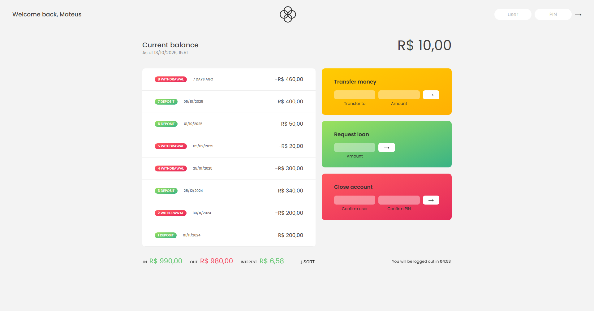

# Bankist-app

O projeto "Bankist" é uma aplicação web que simula as funcionalidades básicas de um internet banking, focando na gestão de contas, visualização de extrato, e realização de transações. Desenvolvido ao longo do curso The Complete JavaScript Course 2025: From Zero to Expert! ministrado pelo professor Jonas Schmedtmann.

## Conceitos Utilizados

### Estrutura de Dados e Lógica de Negócio
- Dados em Array de Objetos: Contas bancárias modeladas usando um Array de Objetos, onde cada objeto armazena dados como owner, movements (transações), pin, interestRate, currency e locale.
- Criação de Usuário: Uso de forEach combinado com métodos de string (toLowerCase, split, map, join) para gerar usernames para cada conta.
- Lógica de Login: Implementada a autenticação que usa find() para localizar a conta pelo username e verifica o pin.

### Manipulação de Arrays e Cálculos Financeiros
- Cálculo de Saldo: Uso do método reduce() para somar todas as movimentações e determinar o saldo atual da conta.
- Cálculo de Sumário: Uso combinado de filter() e reduce() para calcular o total de depósitos, saques e juros (interest).
- Transações: Uso de push() para adicionar novas transações aos arrays.
- Empréstimo: Uso de some() para verificar se o cliente possui algum depósito que seja pelo menos 10% do valor solicitado.
- Fechamento de Conta: Uso de findIndex() para localizar o índice da conta no array principal e splice() para removê-la.
- Ordenação: Implementação da funcionalidade de ordenar as movimentações usando o método sort() e alternando o estado de ordenação (sorted).

### Manipulação do DOM e Interface (UI)
- Seleção de Elementos: Uso de document.querySelector para referenciar todos os elementos da interface.
- Renderização Dinâmica: Uso de innerHTML = '' para limpar e insertAdjacentHTML('afterbegin', html) para adicionar dinamicamente o HTML das linhas de transação (movements).
- Tratamento de Eventos: Uso de addEventListener em botões e formulários para capturar a interação do usuário e executar as funções de transação e login.
- Atualização de UI: Função centralizada (updateUI) para recalcular e renderizar o saldo, o sumário e as movimentações após cada transação.

### Datas e Internacionalização (API Intl)
- Formato de Moeda: Uso de Intl.NumberFormat para formatar corretamente os valores financeiros de acordo com a currency e locale de cada conta (ex: EUR, USD, BRL).
- Formato de Data: Uso de Intl.DateTimeFormat para formatar datas e horas.
- Datas Relativas: Função que calcula a diferença de dias entre a data da transação e o dia atual para exibir "Today", "Yesterday" ou "X days ago".

### Funções Assíncronas e Timers
- Cronômetro de Logout: Implementação de um timer de 5 minutos usando setInterval() para fazer a contagem regressiva e deslogar o usuário por inatividade.
- Simulação de Aprovação: Uso de setTimeout() com 3 segundos de atraso para simular o tempo de processamento de um pedido de empréstimo.
- Gerenciamento de Timer: Uso de clearInterval() para reiniciar ou parar o cronômetro conforme o usuário realiza novas ações ou faz o logout.

## Acesse Aqui

<a href="https://mttoledo.github.io/bankist-app/" target=_blank>Visit my project</a>

## Screenshots

Este é o flowchart desenvolvido pelo professor Jonas, utilizado como base para a realização do projeto.

  

Esta é uma screenshot do projeto finalizado e em pleno funcionamento.

  

